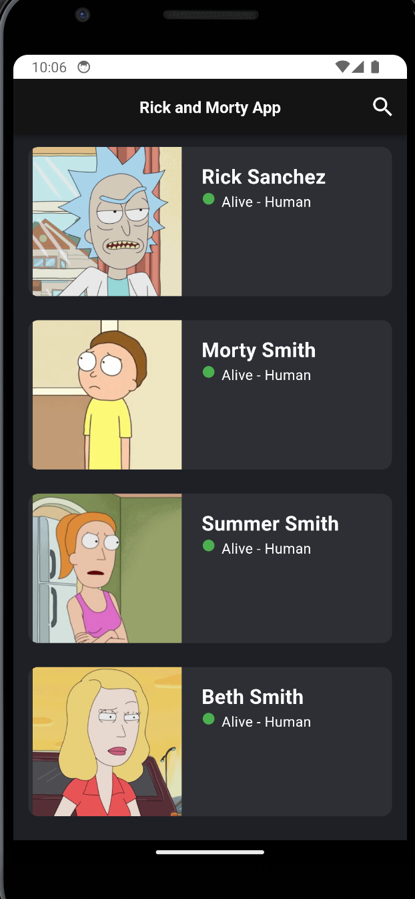
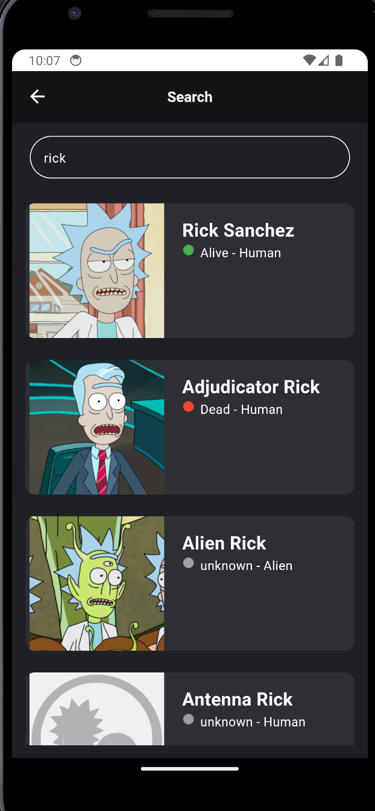
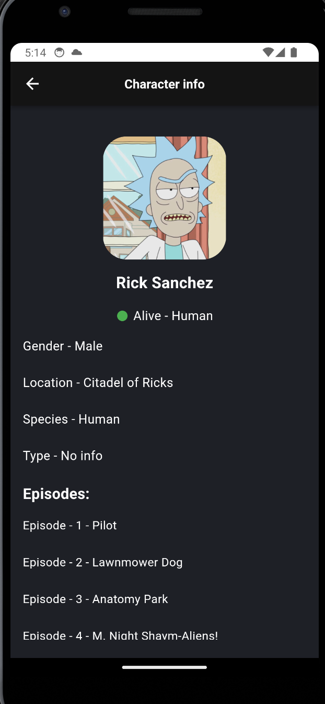
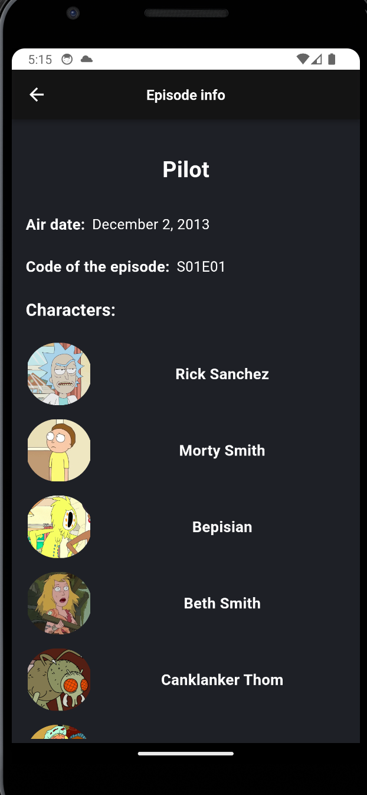

# rick_and_morty_app

## 📱 Rick and Morty API Testing App

#### A Flutter application built for testing and exploring the Rick and Morty API.

## ✅ Implemented Features

#### 📄 Pagination support for the main list of characters

#### 🔍 Search by character name

#### 🔗 Deep navigation flow:
##### Characters list → Character info → Episode info

#### 🌐 Network outage handling (retry requests once the network is restored)

#### ⏳ Loading state handling across all data-fetching operations

## 🧩 Architecture Overview
### MVVM + BloC
lib/
 ├─ core/
 │   ├─ exceptions/
 │   └─ network/
 ├─ model/
 ├─ services/
 │   ├─ episode_service/
 │   └─ character_servivce/
 ├─ view/
 │   ├─ bloc/
 │   ├─ pages/
 │   └─ widgets/
 ├─ view_model/
 │   ├─ character_view_model/
 └─  └─ episodes_view_model/

#### View — Flutter UI widgets
#### ViewModel — communicates with services, prepares data
#### BLoC — state machine that exposes states to the UI
#### Service layer — API calls using dio

## 🛠️ Core Technologies & Architecture

#### - State Management: flutter_bloc
##### (A powerful reactive state-management library built on top of Provider)

#### - Architecture Pattern: MVVM
##### (Clean separation between UI, logic, and data layers)

#### - HTTP Client: dio
##### (Efficient networking, interceptors, error handling)

#### - Service Locator: get_it
##### (Used for dependency injection and singletons)

### I highly recommend it to everyone and thank you for the opportunity.
#### https://rickandmortyapi.com/
